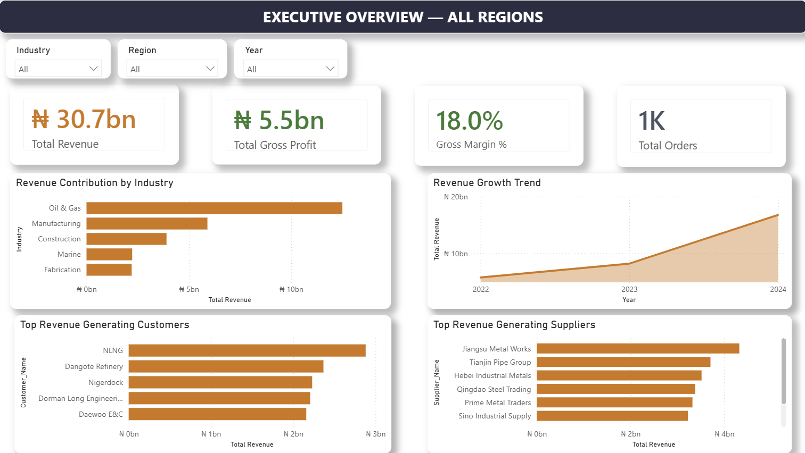
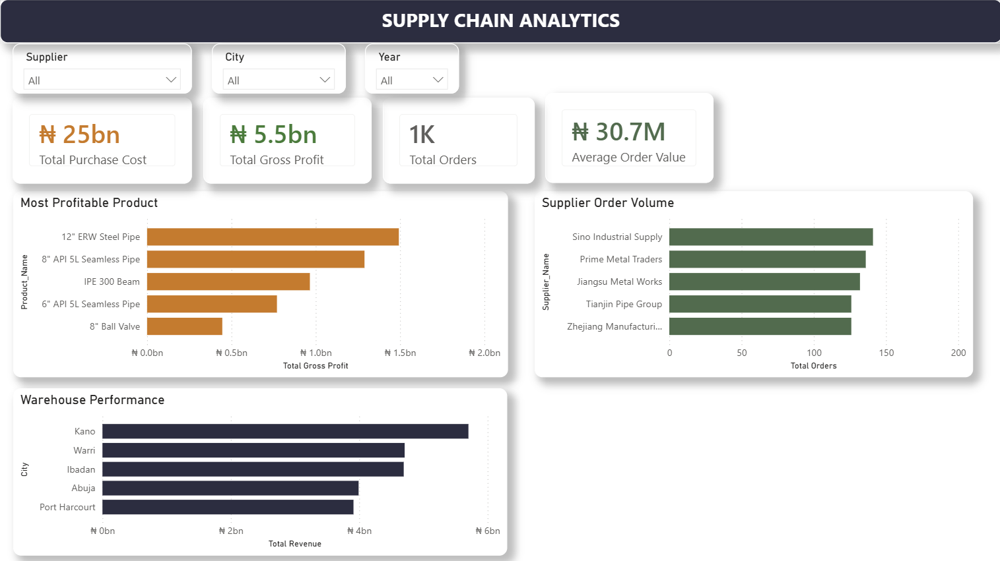
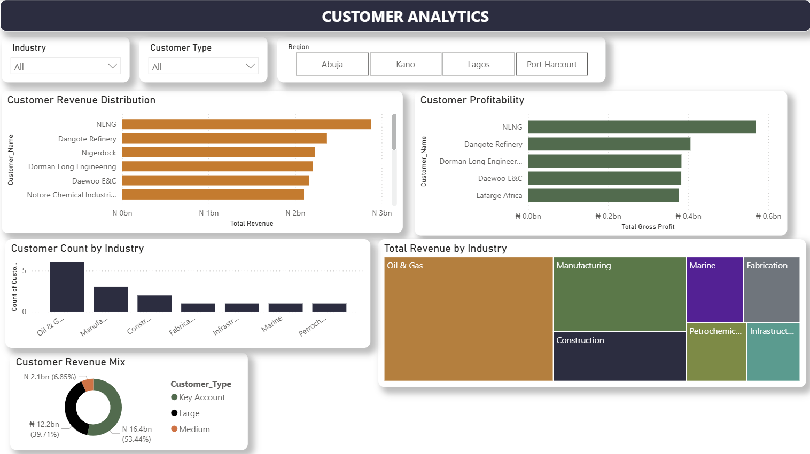

# Industrial Customer & Supply Chain Analytics Dashboard

## Project Overview

This project presents an end-to-end Power BI dashboard designed to analyse customer performance, supply chain operations, procurement activities, supplier contribution, and warehouse performance within an industrial distribution business environment.

The dashboard was developed to provide decision-makers with actionable insights into revenue generation, profitability, customer concentration, supplier dependency, and operational efficiency.

---

## Business Objectives

The dashboard aims to answer the following business questions:

- Which industries generate the highest revenue?
- Which customers contribute the most revenue and profit?
- Which products deliver the highest profitability?
- Which suppliers drive the largest order volumes?
- Which warehouse locations perform best?
- How is revenue distributed across customer segments?
- How are revenues and profits changing over time?

---

# Dashboard Pages

## 1. Executive Overview

Provides a high-level summary of business performance including:

- Total Revenue
- Total Purchase Cost
- Total Gross Profit
- Gross Margin %
- Total Orders
- Revenue Trend Analysis
- Revenue by Industry
- Top Customers
- Top Suppliers

### Key Insights
- Oil & Gas contributes the largest share of revenue.
- Revenue has grown consistently across the reporting period.
- A small number of customers contribute a significant proportion of total sales.

---

## 2. Supply Chain Analytics

Focuses on procurement and operational performance.

### Visuals Included

- Most Profitable Products
- Supplier Order Volume
- Warehouse Performance
- Total Purchase Cost KPI
- Gross Profit KPI
- Average Order Value KPI
- Total Orders KPI

### Interactive Filters

- Supplier
- Warehouse Location
- Year

### Key Insights

- Certain suppliers account for a disproportionately high share of purchase activity.
- Warehouse performance varies significantly by location.
- Product profitability is highly concentrated among a few product categories.

---

## 3. Customer Analytics

Provides insights into customer behaviour and segmentation.

### Visuals Included

- Customer Revenue Distribution
- Customer Profitability Analysis
- Customer Count by Industry
- Revenue by Industry Treemap
- Customer Revenue Mix

### Interactive Filters

- Industry
- Customer Type
- Region

### Key Insights

- Key Account customers generate the majority of revenue.
- Customer profitability does not always align with customer revenue contribution.
- The customer portfolio is heavily concentrated in industrial sectors such as Oil & Gas and Manufacturing.

---

## Tools & Technologies

- Power BI Desktop
- DAX
- Power Query
- Data Modelling
- Microsoft Excel

---

## Data Model

The dashboard uses a star schema model consisting of:

### Fact Table
- Fact_Sales

### Dimension Tables
- Dim_Customers
- Dim_Products
- Dim_Suppliers
- Dim_Warehouses

---

## Skills Demonstrated

- Data Cleaning
- Data Modelling
- DAX Measures
- KPI Development
- Interactive Dashboard Design
- Supply Chain Analytics
- Customer Analytics
- Procurement Analytics
- Business Intelligence Reporting

---

## Dashboard Preview

### Executive Overview

### Supply Chain Analytics

### Customer Analytics

---

## Author

Chibuike Henry I.

Data Analyst | Supply Chain Analytics | Procurement Analytics | Business Intelligence

GitHub: https://github.com/CHI-analytics

LinkedIn: https://www.linkedin.com/in/chibuike-henry-igwebuike/
