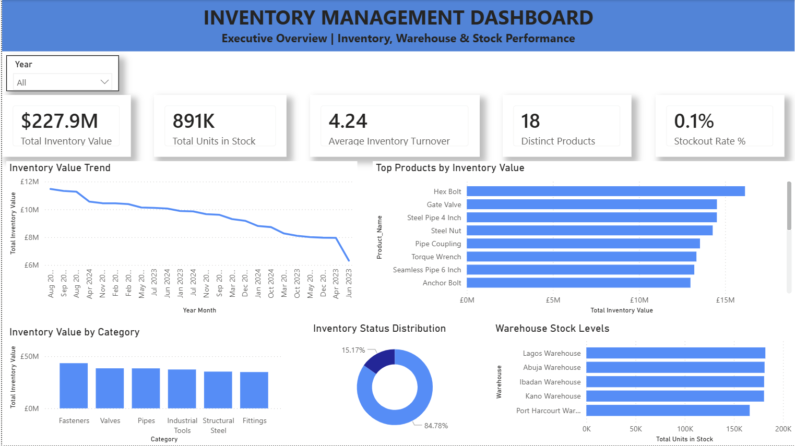

# Inventory Management Dashboard

## Executive Summary

This Inventory Management Dashboard provides a comprehensive view of inventory performance, stock availability, warehouse operations, and inventory turnover. The dashboard helps inventory managers and supply chain teams monitor inventory KPIs, identify stock risks, and improve inventory optimization decisions.

---

## Business Problem

Organizations require real-time visibility into inventory levels, stock movements, warehouse performance, and inventory turnover to avoid stockouts, reduce carrying costs, and improve operational efficiency.

Without centralized reporting, organizations may struggle to:

- Monitor inventory value across products
- Identify slow-moving inventory
- Track inventory turnover performance
- Manage warehouse stock levels
- Prevent stock shortages and overstocking

This dashboard consolidates inventory data into an interactive reporting solution that supports inventory planning and operational decision-making.

---

## Dashboard Preview

---

## Key Performance Indicators (KPIs)

The dashboard tracks the following inventory metrics:

- Total Inventory Value
- Total Units in Stock
- Average Inventory Turnover
- Product Count
- Stockout Rate %

---

## Key Business Questions

This dashboard helps answer important inventory management questions such as:

- What is the total inventory value?
- Which products represent the highest inventory investment?
- How are inventory levels changing over time?
- What percentage of products are low stock or out of stock?
- Which warehouses hold the highest stock quantities?
- What product categories contribute most to inventory value?

---

## Dashboard Features

### Executive Inventory Overview

Provides a high-level summary of inventory KPIs and stock performance.

### Inventory Value Trend Analysis

Tracks inventory value across time periods to identify inventory movement patterns.

### Product Inventory Analysis

Highlights products with the highest inventory value.

### Inventory Status Distribution

Monitors inventory health across inventory status categories.

### Warehouse Stock Analysis

Compares stock levels across warehouse locations.

### Category-Level Inventory Analysis

Analyzes inventory value across product categories.

---

## Key Insights

Key insights generated from the dashboard include:

- Inventory value exceeded $227M during the analysis period.
- Inventory is concentrated across a small number of high-value products.
- Warehouse stock levels are distributed across multiple locations.
- Inventory turnover performance indicates product movement efficiency.
- Category-level analysis highlights the largest inventory investments.

---

## Tools & Technologies

- Power BI
- Power Query
- DAX
- Excel
- Data Modeling
- Data Visualization

---

## Skills Demonstrated

This project demonstrates:

- Inventory Analytics
- Supply Chain Analytics
- Business Intelligence Reporting
- KPI Development
- Data Modeling
- DAX Measures
- Dashboard Design
- Data Visualization
- Inventory Performance Monitoring
- Executive Reporting

---

## Business Value

The dashboard provides inventory managers and business leaders with actionable insights to:

- Improve inventory visibility
- Reduce stock shortages
- Optimize inventory investment
- Improve warehouse management
- Monitor inventory efficiency
- Support inventory planning decisions

---

## Author

**CHI Analytics**
