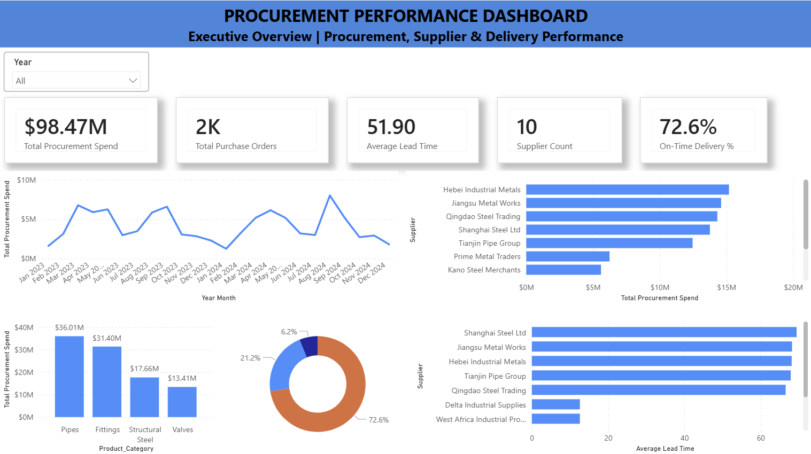

# Procurement Performance Dashboard

## Project Overview

This project analyzes procurement performance data to provide insights into supplier management, procurement spend, purchase trends, lead times, and overall sourcing efficiency.

The dashboard is designed to support procurement and supply chain decision-making through data-driven insights and KPI monitoring.

## Business Problem

Organizations rely on effective procurement processes to control costs, maintain supplier performance, and ensure timely product availability.

This dashboard helps answer key questions:

* Who are the top suppliers by spend?
* What are the procurement cost trends?
* Which suppliers have the shortest and longest lead times?
* How efficient is the procurement process?
* What opportunities exist for cost optimization?

## Tools Used

* Power BI
* Excel
* SQL
* DAX

## Key Metrics

* Total Procurement Spend
* Purchase Orders
* Supplier Performance
* Average Lead Time
* Procurement Cost Trends
* Top Suppliers by Spend

## Dashboard Features

* Procurement Overview
* Supplier Performance Analysis
* Lead Time Analysis
* Spend Analysis
* Procurement KPI Monitoring

## Business Value

The dashboard provides visibility into procurement operations and supports informed decision-making related to supplier management, cost control, and operational efficiency.
