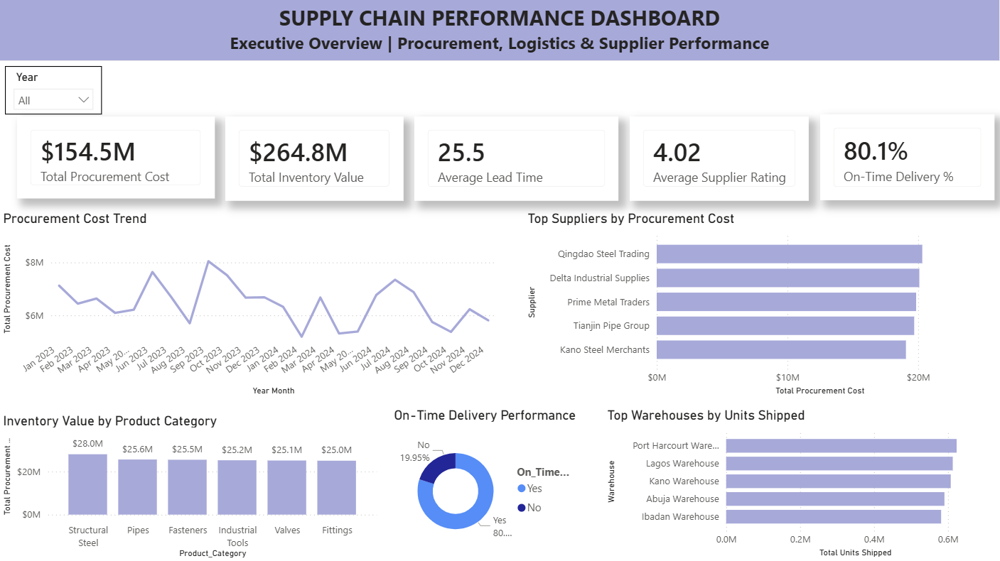

# Supply Chain Performance Dashboard

## Project Overview

This Power BI dashboard provides a comprehensive view of supply chain performance across procurement, inventory, logistics, supplier performance, and warehouse operations.

The dashboard enables business leaders and supply chain managers to monitor key operational metrics, evaluate supplier effectiveness, track inventory investment, and improve overall supply chain efficiency.

---

## Business Problem

Organizations often struggle to gain visibility into procurement costs, supplier performance, inventory investment, warehouse utilization, and delivery performance.

Without centralized reporting, decision-makers may find it difficult to:

* Monitor procurement spending trends
* Evaluate supplier performance
* Track inventory value across product categories
* Measure delivery reliability
* Optimize warehouse operations
* Improve supply chain efficiency

This dashboard consolidates critical supply chain metrics into a single interactive reporting solution.

---

## Dashboard Preview

---

## Key Performance Indicators (KPIs)

The dashboard tracks:

* Total Procurement Cost
* Total Inventory Value
* Average Lead Time
* Average Supplier Rating
* On-Time Delivery %

---

## Key Business Questions

This dashboard helps answer:

* What is the total procurement spend?
* Which suppliers contribute the highest procurement costs?
* How are procurement costs changing over time?
* Which product categories hold the highest inventory value?
* What percentage of deliveries are completed on time?
* Which warehouses ship the highest volume of products?

---

## Dashboard Features

### Procurement Cost Trend

Tracks procurement spending over time.

### Supplier Performance Analysis

Highlights suppliers with the highest procurement costs.

### Inventory Category Analysis

Compares inventory value across product categories.

### On-Time Delivery Monitoring

Measures delivery reliability and performance.

### Warehouse Shipping Analysis

Compares warehouse shipment volumes.

---

## Key Insights

* Procurement costs exceeded $150M during the analysis period.
* Inventory value surpassed $260M across categories.
* Supplier ratings averaged above 4.0.
* More than 80% of deliveries were completed on time.
* Warehouse shipment volumes were distributed across multiple locations.

---

## Tools & Technologies

* Power BI
* Power Query
* DAX
* Excel
* Data Modeling
* Data Visualization

---

## Skills Demonstrated

* Supply Chain Analytics
* Procurement Analytics
* Inventory Management
* Supplier Performance Analysis
* Logistics Reporting
* KPI Development
* Data Modeling
* Dashboard Design
* Business Intelligence Reporting

---

## Author

CHI Analytics
