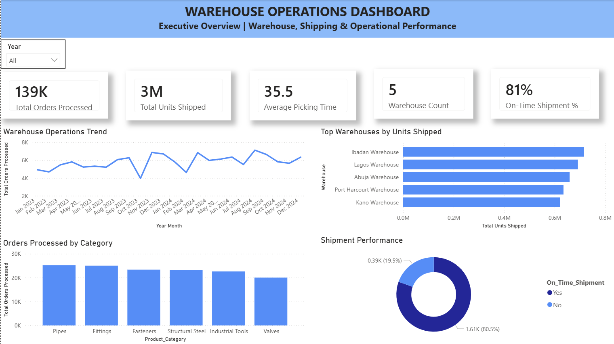

# Warehouse Operations Dashboard

## Executive Summary

This Warehouse Operations Dashboard provides a comprehensive view of warehouse performance, shipping efficiency, order fulfillment, and operational productivity. The dashboard enables warehouse managers and operations teams to monitor key KPIs, identify performance trends, and improve warehouse efficiency through data-driven decision-making.

---

## Business Problem

Warehouse operations play a critical role in ensuring products are processed, stored, and shipped efficiently. Without centralized reporting, organizations may struggle to:

- Monitor warehouse productivity
- Track shipping performance
- Measure order fulfillment efficiency
- Identify operational bottlenecks
- Optimize warehouse resource utilization

This dashboard consolidates warehouse operational data into a single performance monitoring solution.

---

## Dashboard Preview

---

## Key Performance Indicators (KPIs)

The dashboard tracks the following warehouse metrics:

- Total Orders Processed
- Total Units Shipped
- Average Picking Time
- Warehouse Count
- On-Time Shipment %
- Warehouse Operational Performance

---

## Key Business Questions

This dashboard helps answer important operational questions such as:

- How many orders have been processed?
- How many units have been shipped?
- Which warehouses handle the highest shipment volumes?
- How efficient is the order picking process?
- What percentage of shipments are delivered on time?
- Which product categories generate the highest warehouse activity?

---

## Dashboard Features

### Executive Warehouse Overview

Provides a high-level summary of warehouse operational KPIs.

### Warehouse Operations Trend

Tracks order processing performance over time to identify operational patterns and seasonal fluctuations.

### Top Warehouses by Units Shipped

Highlights warehouse locations with the highest shipping volumes.

### Orders Processed by Category

Analyzes operational workload across product categories.

### Shipment Performance Analysis

Monitors on-time shipment performance and delivery reliability.

---

## Key Insights

Key insights generated from the dashboard include:

- Over 139K orders were processed during the analysis period.
- More than 3 million units were shipped across warehouse locations.
- On-time shipment performance exceeded 80%.
- Certain warehouses contribute significantly more shipment volume than others.
- Product categories such as Pipes and Fittings account for the highest warehouse activity.
- Picking time metrics help identify opportunities for operational improvement.

---

## Tools & Technologies

- Power BI
- Power Query
- DAX
- Excel
- Data Modeling
- Data Visualization

---

## Skills Demonstrated

This project demonstrates:

- Warehouse Analytics
- Supply Chain Analytics
- Operations Reporting
- KPI Development
- Data Modeling
- DAX Measures
- Dashboard Design
- Data Visualization
- Performance Monitoring
- Executive Reporting

---

## Business Value

The dashboard provides warehouse managers and business leaders with actionable insights to:

- Improve warehouse productivity
- Increase shipping efficiency
- Monitor operational performance
- Reduce fulfillment bottlenecks
- Support data-driven warehouse planning
- Improve customer service through better delivery performance

---

## Author

**CHI Analytics**
